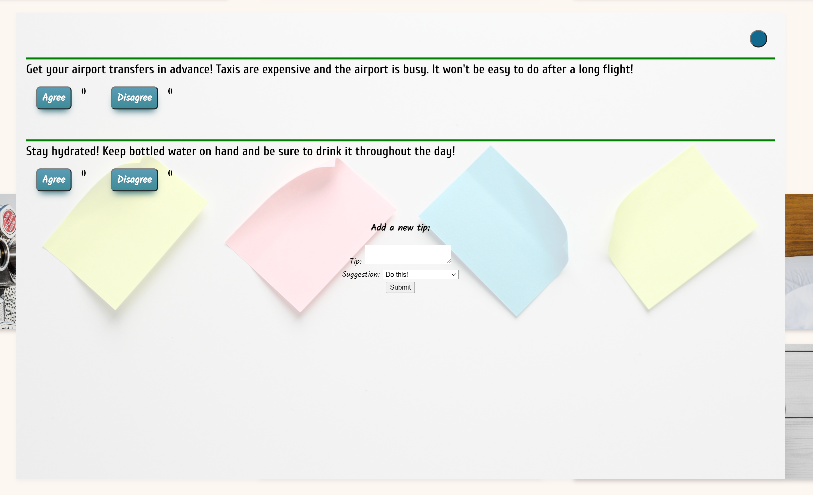

# Travel Tips

An app created to bring travellers together to help each other in their exploration of the world around us!

[Project Walkthrough Video](https://youtu.be/7XZx9x8PlTM)

## Table of contents

- [General info](#general-info)
- [Screenshots](#screenshots)
- [Technologies](#technologies)
- [Setup](#setup)
- [Features](#features)
- [Status](#status)
- [Inspiration](#inspiration)
- [Contact](#contact)

## General info

Getting ready for your next vacation? Or just dreaming of a break from the monotony of day to day life? Either way, come take a look at the Travel Tips site! You can find tips from other users when planning your next vacation on what to pack, where to eat or a variety of different subjects. Or you can leave your own tips to help out others in their future travels! You can also agree or disagree with tips that have already been left to help others in their planning.
Come along today and let's get travelling!

## Screenshots

## Technologies

- JavaScript
- CSS

\***\*To see more about this process:\*\***

[Project Blog Post](https://dev.to/meemeek/the-beginning-of-a-beautiful-friendship-with-javascript-hopefully-3fkj)

THANKS FOR CHECKING OUT MY PROJECT!

## Setup

- Clone this repo to your local machine `git clone <this-repo-url>`
- run `cd travel-tips-project-frontend` to access
- run `npm install` to install required dependencies
- run `npm start` to start application on your local machine

_Also need to install travel-tips for database_

## Features

- SPA created with Vanilla JS.
- Created functional pop-up cards with prioritized tip information based on user feedback.
- Ability to search destinations and create new destinations and tips.

To-do list:

- Clean up new tip functionality (stay in card)
- Clickable features change on mouse over.

## Status

Project is in progress.

## Inspiration

Project inspired by my love for traveling and the hours spent researching each destination before my trips.

## Contact

Bug reports and pull requests are welcome on GitHub at https://github.com/mimirandi21/travel-tips-project-frontend.
